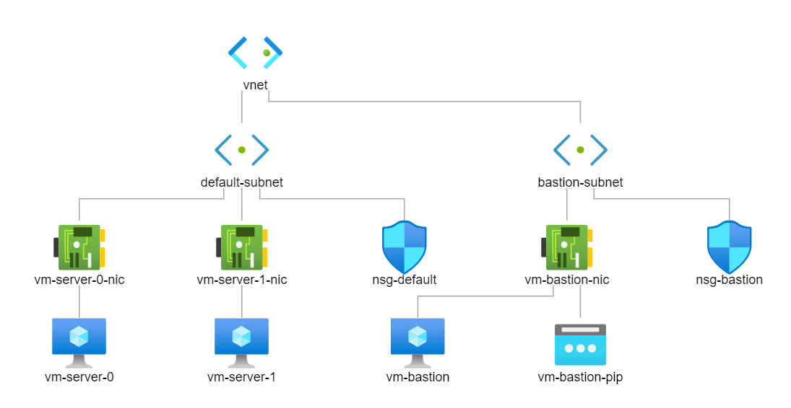

# create-bastion-vnet



## Example

```
$ cd tmp
$ git clone https://github.com/OpenJNY/azure-templates 
$ cd azure-templates/vm/create-bastion-vnet
$ cat <<EOF > terraform.tfvars 
resource_group_name = "devlb-rg"
username            = "openjny"
password            = "AwesomePassw0rd"
EOF

$ terraform init
$ terraform apply
```